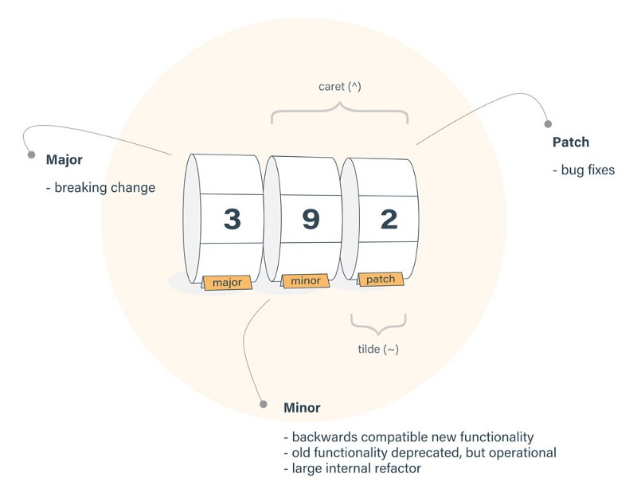

# UI Bootcamps - Node.Js


## __IMPORTANT DISCLAIMER__
This is not your typical _crash course_, this is a **Bootcamp**.

What does that mean?

- _You will give your best_

- _We will give our best_

- _We will all have a good time_


But most important, there will be **A LOT** of humor, because a happy developer _(student, pupil, padawan, you get the point...)_ is a great and hard working developer.


_That said..._


## Welcome to the bootcamp, learning time has begun


Please, use this repository as a base for all your work. The idea is to
fork this project so everyone uses the same folder structure for the
exercises.

### Index

1. [Objective](#objective)

2. [Who Should Attend](#who-should-attend)

3. [Duration](#duration)

4. [Technical Assistance](#technical-assistance)

5. [Performance Measurement](#performance-measurement)

6. [Handling advanced Developers](#handling-advanced-developers)

7. [Materials](#materials)

8. [Bootcamp Schedule](#bootcamp-schedule)

9. [General Guidelines](#general-guidelines)

10. [Learning Days](#learning-days)

  - 10.1 [Week 1: Knowing your Node](#week-1-knowing-your-node)
  - 10.2 [Week 2: Js and Node: Brothers in arms](#week-2-js-and-node-brothers-in-arms)
  - 10.3 [Week 3: From REST to TEST](#week-3-from-rest-to-test)
  - 10.4 [Week 4: Store and Deploy](#week-4-store-and-deploy)

11. [Final Project](#final-project)

### Objective

We will teach you the basics of REST API development and Node.Js development.

→ [index](#index)

### Who Should Attend

The materials will start at a low level and does not require in depth knowledge
of the platform in question. Desirable participant profile: trainees and outside
Globant candidates. A basic knowledge on OOP is desired, though.

→ [index](#index)

### Duration

Four weeks total. (20 days)

→ [index](#index)

### Technical Assistance

You can contact other Bootcamp participants or any available tutor if you need
technical assistance. Communications will take place over [Slack](https://slack.com/features) on our own [Bootcamp Workspace](https://globant-bootcamps-lp.slack.com)

→ [index](#index)

### Performance Measurement

1. Code review after each practice.

2. Checkpoint completion after Learning stage with your assigned tutor.

3. Final Application after Bootcamp.

→ [index](#index)


### Handling Advanced Developers

Developers that move faster than average can go ahead and complete as much
exercises as wanted.

→ [index](#index)

### Materials

1. You will need to install [Node.JS](https://nodejs.org/en/) (Version 10) (NVM is strongly recommended - [Unix](https://github.com/creationix/nvm#installation)/[Windows](https://github.com/coreybutler/nvm-windows))

2. The recommended IDE is [Visual Studio Code](https://code.visualstudio.com/). However, you can use any IDE of your preference.

3. Gmail Account + headset (For hangout calls)

4. Create your own [GitHub](https://github.com/) account. Follow
this [guideline](https://help.github.com/articles/set-up-git) to setup your
account. Also you can read further about Git in
[Try Git](https://try.github.io/levels/1/challenges/1) or
[Learn Git Branching](http://pcottle.github.io/learnGitBranching/)

5. Fork this repo to use as a base to host the project code.

→ [index](#index)

### Bootcamp Schedule

The Bootcamp is organized in the following way:


TBD

The last week will be focused on starting an app and learning some _shiny cool_ stuff. You need to present your work at the end of the week, _however_
you can keep working on it (more on that later).

→ [index](#index)

### General Guidelines

1. [Team play](http://www.dummies.com/how-to/content/ten-qualities-of-an-effective-team-player.html) is encouraged but the work will be evaluated per person.

2. The instructions will be vague as they generally are in real life projects.
You must look for support and guidance from your PM, teammates and tutors.

3. All code and documentation must be in English.

4. `Js` code must adhere to Globant's [Js Style Guide](https://github.com/globant-ui/JavaScript-style-guide).

→ [index](#index)

### Learning Days ###

Each day you will grab the fundamentals of building blocks for usual
`Node` applications.

On each learning day you will have to:

1. **Read:**
We will provide you with documentation related with current sprint content so
you can have a background reference, guide and examples to complete the
following practice.

2. **Practice:**
You will implement the previously gathered knowledge in simple coding activities.

3. **Commit:**
You will commit all your code on a daily basis, when you finish your practice. This will not apply for code of Week 4.

→ [index](#index)

## Introduction

  - This repository contains inside the `src` directory the project structure for all exercises/challenges that you will
  need to do.

  - All `.js` code can be opened directly on the console. You can start a node process with `node PATH_TO_FILE`

  - A `start` script will be needed for processes. That should be used as `npm start`

  - [Basic GIT concepts](http://rogerdudler.github.io/git-guide/)

  - __READ THAT__ :arrow_up: :arrow_up: :arrow_up:

  - [Extra GIT material](https://www.acamica.com/cursos/29/git)

→ [index](#index)

_Now let's get down to business_

## Week 1: Knowing your Node
### Chapter 1: Intro
So you want to learn Node.js? Cool, I guess you already know JS, why would you be here if not?
Ok, you can always refresh some stuff [here](https://github.com/globant-ui/angular-bootcamp#day-3---5-hello-javascript)

So, now that we are on the same page let's start with the basics

>_Node.js is Javascript that runs on the server_


Yes, that's it. It uses Google's engine, (yes, Javascript runs on an engine) called [__V8__](https://v8.dev/) and you don't need a browser to use it.

#### Reading:
 - [What is Node.js](https://medium.freecodecamp.org/what-exactly-is-node-js-ae36e97449f5)
 - [Node versions](https://nodesource.com/blog/understanding-how-node-js-release-lines-work/)
 - [REPL](https://hackernoon.com/know-node-repl-better-dbd15bca0af6)

### Chapter 2:  Basics
Let's talk shop.

Node just runs Javascript, but you actually need more than that to make an app. You need some kind of code modularization,
some kind of debugging tool and, of course, other people's code :grimacing:.


#### What is npm and what are packages?

The letters ```npm``` stand for “node package manager”. When you are working on a JavaScript project, you can use npm to install other people’s code packages into your own project. Your project might be a web project like a website or web app, or it could be a server-side project using node. Any JavaScript project can use npm to pull in packages of existing code.

npm is a tool you install on your computer. It’s part of node, so [install the LTS version of Node](https://nodejs.org/en/) to get both the ```node``` and ```npm``` commands in your command line. It must be installed on every computer where you want to work on your project, so if you move your files around using a USB drive don’t forget that part!

You use npm from the command line to install, uninstall or update packages. By “package” I mean any piece of code which someone has chosen to publish on npm.

Some examples of npm packages are:

Angular<br>
React<br>
jQuery<br>
Express<br>
Socket.io

There are thousands of packages published on npm. You can browse them on [npmjs.com](https://www.npmjs.com/), but usually you will find recommended packages by searching on Google or following blog posts. Some packages are only suitable for web projects, and some are only suitable for node projects.

#### Using npm in a project
To use npm packages in a project, your project must contain a file called package.json. This file keeps a list of all the packages you are using, and which version of each one you have chosen to use.

##### If your file does not have a package.json 
then you can create one from the command line by running npm init inside your project.

```
cd example-project
npm init
```
or 

Generate it without having it ask any questions:

```
$ mkdir my-npm-pkg && cd my-npm-pkg
$ npm init -y
```

#### Installing packages

Each time you open your project on a different computer, you may have to reinstall all your packages. This is especially true if you are moving between Mac and Windows. This is because not all packages are cross-compatible, and sometimes need a version downloaded for the specific system you are using it on.

When you open a project for the first time or on a different computer, reinstall all your packages:

```
cd example-project
npm install
or
npm i
```

After running ```npm install``` there will be a new folder in your project called ```node_modules```. This folder contains all the code for all the packages you have installed. It also contains all that packages that your packages installed. It can get pretty big.

Here’s a programmer joke you can now consider yourself “in on”:

image_node_modules


To install a new package, use the command ```npm install``` followed by the name of the package. Include the ```--save``` flag to ensure the library is added to your ```package.json``` so you can install or update it again later:

```
npm install that-cool-thing --save
```

If everything explodes and you don’t understand the errors and you don’t know what to do, first try deleting your ```node_modules``` folder and then running a fresh npm install. You’ll get the hang of it, don’t panic!

#### Basic NPM Commands

##### Installing packages:

__Locally__: A locally installed package can be accessed only on the folder you’ve downloaded it.

The node_modules is the folder in which our local packages are installed. There will be a new file named package-lock.json. This file contains the exact version of the package, unlike package.json which contains the semantic version

You can also install packages as a developer dependency i.e., these packages are only needed for development. For example, they can be any package for testing the project. To install packages as a developer dependency use the command

```
npm install <package_name> --save-dev
or
npm i -D <package_name>
```

__Globally__: A globally installed packages works anywhere on the machine. To install global packages you’ve to use -g flag.

Generally, any packages you use in your project have to be installed locally. And packages you use in the command line are to be installed globally.

The command for the local and global packages are same except that you have to use -g flag for global packages.


##### Updating packages:

Since we have installed packages sometimes we need to update our packages to get new features. To do that, you’ve to use

```
npm update <package_name>
```

for a specific package (or) just

```
npm update
```

to update all packages.

For global packages, you’ve to use -g.

```
npm update <package_name> -g
```


##### Uninstalling packages:

Sometimes you don’t need a particular package and you want to remove it. It’s not a good idea to manually remove the package from the node_modules folder as it can be a dependency for the other packages. So, to safely remove a package you’ve to use the command

```
npm uninstall <package_name>
```

For global packages,

```
npm uninstall <package_name> -g
```

##### Installing from package.json:

If you want to share your project then you may not want to share all your node modules. So, you will be sharing only your package.json which contains the packages needed for your project. And also If you want to contribute to some others project then you need to download the project and install packages in it. To do that, you have to use the command

```
npm install

or

npm i
```

##### List of installed packages:

To get the list of installed packages, use the command

```
npm list
```

#### Semantic versioning:




All the package versions are represented with three digits. The first digit is major, second is minor and third is patch(see fig).

patch(~) is updated for bug fixes. You can update patch from the command

minor(^) is updated for every new functionality that doesn’t break the existing code.

major is updated for big changes. These generally break the existing code.

In the package.json, when you install a package, you will see a caret(^) symbol by default. This indicates that when a user is downloading your project, the package will be updated to the latest minor version. Same applies to patch. If we don’t include any symbol then exact version is downloaded. To get the latest major version, asterisk(*) is used. But you don’t want to do this as the major version can break your code.

To install either major, minor, patch (or) exact version, you can use the command

```
npm install <package_name>@x.y.z
```

#### Getting help:

npm CLI has built -n help command. You can access it by

```
npm help
```

To get help for a particular command, use the command

```
npm <command> -h
```

You can also search npm documentation for help. To do that use

```
npm help-search <command>
```

#### What are NPM Scripts?

NPM scripts are, well, scripts. We use scripts to automate repetitive tasks. For example, building your project, minifying Cascading Style Sheets (CSS) and JavaScript (JS) files. Scripts are also used in deleting temporary files and folders, etc,. There are many ways to pull this off — you could write bash/batch scripts, or use a task runner like Gulp or Grunt. However, a lot of people are moving over to NPM scripts for their simplicity and versatility. They also offer possibility of having fewer tools to learn, use, and keep track of.

Now that we have (some) idea of what NPM scripts are and what they can do for us, let’s go ahead and write some!

##### The Scripts Object in package.json

Most of our work will happen in the package.json file that NPM uses as a manifest of sorts.

Here’s a sample package.json file:

```
{   
    "name": "super-cool-package",   
    "version": "1.0.0",   
    "scripts": {    
        ...   
    }, 
    "dependencies": { 
        ...
    }    
    "devDependencies": {     
        ...   
    } 
}
```


If you’ve been working with NodeJS and NPM, you will be familiar with the package.json file. Notice the scripts object in the file. This is where our NPM scripts will go. NPM scripts are written as usual JSON key-value pairs where the key is the name of the script and the value contains the script you want to execute.

Here’s perhaps the most popular NPM script (and it’s also a special kind of script):

```
"scripts": {
    "start": "node index.js",
    ...
}
```

You’ve probably seen this tons of times in your package.json files. And you probably know that you can type npm start to execute the script. But this example illustrates the first important aspect of NPM scripts — they are simply terminal commands. They run in the shell of the OS on which they’re executed. So it might be bash for Linux and cmd.exe for Windows.

##### Custom Scripts

NPM also let’s you define your own custom scripts. Let’s look at a super basic custom NPM script that outputs “hello world” to the console. Add this to the scripts object of your package.json file:

```
"say-hello": "echo 'Hello World'"
```

The scripts object in your package.json file should look like this:

```
...
"scripts": {
    "start": "node index.js",
    "say-hello": "echo 'Hello World!'"
}
```

Now try running ```npm say-hello```. Doesn’t work? This is because custom NPM scripts must be preceded by either run-script or run for them to be executed correctly. Try running ```npm run-script say-hello``` or ```npm run say-hello```. The console says, “Hello World!”! We’ve written our first NPM script!

##### Calling NPM Scripts Within Other NPM Scripts

One downside of using NPM scripts shows up when your script is fairly complex (and long). This problem is compounded by the fact that the JSON spec does not support comments. There are a few ways around this problem. One way is to divide your script into small single-purpose scripts and then call them within other NPM scripts. The way to call an NPM script within another is straightforward. Modify your scripts object so that it looks like this:

```
"scripts": {
    "say-hello": "echo 'Hello World'",
    "awesome-npm": "npm run say-hello && echo 'echo NPM is awesome!'"
}
```
Since NPM scripts execute in the shell, calling npm run say-hello within another NPM script is almost intuitive.


##### Calling Shell and Node Scripts

At times, you may have to write scripts far more complex than ones that can be achieved in 2–3 commands. When this situation arises, one solution is to write bash or JS scripts (or scripts in any scripting language you like) and call them from NPM scripts.

Let’s quickly write a bash script that says hello to you. Create a file called ```hello.sh``` in your root directory and paste this code in it:

```
#!/usr/bin/env bash
# filename: hello.sh
echo "What's your name?"
read name
echo "Hello there, $name!"
```

It’s a simple script that echoes your name back to you. Now modify the ```package.json``` file so that the ```scripts``` object has this line of code:

```
"bash-hello": "bash hello.sh"
```

Now, when you run ```npm run bash-hello```, it asks you for your name and then says hello to you! Brilliant.

You can do the same thing with JS scripts run using node. An advantage of this approach is that this script will be platform independent since it uses node to run. Here’s a slightly more complex JS script to add two integers received as command line arguments (put this in a file named add.js):

```
// add.js
// adds two integers received as command line arguments
function add(a, b) {
    return parseInt(a)+parseInt(b);
}
if(!process.argv[2] || !process.argv[3]) {
    console.log('Insufficient number of arguments! Give two numbers please!');
}
else {
    console.log('The sum of', process.argv[2], 'and', process.argv[3], 'is', add(process.argv[2], process.argv[3]));
}
```

The process.argv object contains the command line arguments given to the script. The first two elements, ```process.argv[0]``` and ```process.argv[1]```, are reserved by node. Thus ```process.argv[2]``` and ```process.argv[3]``` let you access the command line arguments.

Now add this line to the ```scripts``` object of the ```package.json``` file:

```
"js-add": "node add.js"
```

Finally, run the script as an npm script by giving it two numbers as command line arguments:

```
npm run js-add 2 3
```

And the output is

```
The sum of 2 and 3 is 5
```

Brilliant! Now we’re capable of writing much more powerful scripts and leveraging the power of other scripting languages.


#### Reading:
 - [NPM](https://docs.npmjs.com/about-npm)
 - [NVM](https://github.com/creationix/nvm)
 - [Modules](https://www.nodebeginner.org/blog/post/nodejs-tutorial-what-are-node.js-modules/)
 - [Debugging](https://www.nodebeginner.org/blog/post/nodejs-tutorial-what-are-node.js-modules/)
 - [Debugging on VS-Code](https://code.visualstudio.com/docs/nodejs/nodejs-debugging)
 - [Module System](https://medium.freecodecamp.org/anatomy-of-js-module-systems-and-building-libraries-fadcd8dbd0e)

#### Excercise:
If guess you've noticed, but there's a folder called exercises. _Yes, you need to do them_

Go to [chapter_2](/exercises/chapter_2) and follow the instructions.

 → [index](#index)

## Week 2: Js and Node: Brothers in arms
### Chapter 3: All JS
Remember we talked about how Node runs Javascript? Well there's some __KEY__ JS concepts you need to master in order to
make real Node apps.


#### Reading:
 - [Scope & Closures](https://hackernoon.com/javascript-variable-scope-closures-a-primer-ace00b362eae)
 - [Event Driven Architecture](https://medium.freecodecamp.org/understanding-node-js-event-driven-architecture-223292fcbc2d)
 - [Callbacks](https://medium.freecodecamp.org/javascript-callbacks-explained-using-minions-da272f4d9bcd)
 - [Promises](https://hackernoon.com/understanding-promises-in-javascript-13d99df067c1)
 - [Async/Await](https://hackernoon.com/6-reasons-why-javascripts-async-await-blows-promises-away-tutorial-c7ec10518dd9)

 → [index](#index)

#### Excercise:
_You'd better have done the previous excercise_

Go to [chapter_3](/exercises/chapter_3) and follow the instructions.

#### ~Not so~ optional reading
- [Async programming & More](https://eloquentjavascript.net/11_async.html#h_HH3wvnWMnd)

### Chapter 4: Node Ninja
If you want to be a real nodejs developer, you need to know this.


##### What is Bluebird?
Bluebird is a Promise engine substitution that provides significant performance improvements over native ES6 Promise, and also contains a superset API that overlays the native Promise specification.

#### Reading:
- [Bluebird vs ES6 Promises](https://medium.com/@housecor/5-reasons-to-keep-using-bluebird-for-promises-a4f59c8a5d69)
- [Node uses a single thread?](https://codeburst.io/how-node-js-single-thread-mechanism-work-understanding-event-loop-in-nodejs-230f7440b0ea)
- [Clustering](https://medium.com/tech-tajawal/clustering-in-nodejs-utilizing-multiple-processor-cores-75d78aeb0f4f)
- [Threads](https://medium.com/tech-tajawal/threading-in-nodejs-5d966a3b9858)

#### Excercise:
_It's time, let's do it_

Go to [chapter_4](/exercises/chapter_4) and follow the instructions.

#### ~~Not so~~ optional reading
- [JWT](https://jwt.io/introduction/)
- [What’s New in Node 10](https://levelup.gitconnected.com/whats-new-in-node-10-ad360ae55ee4)

## Week 3: From REST to TEST
### Chapter 5: Getting

 - REST
 - Express
 - Middlewares
 - Validations

#### REST

OK, now, we're going to take a REST.

[rest.jpg]

Oh, no, we're not talking about THAT rest. We're talking about this REST:

REpresentational State Transfer

##### And... what does it means?

It means when a RESTful API is called, the server will transfer to the client a representation of the state of the requested resource.

The representation of the state can be in a JSON format, and probably for most APIs this is indeed the case. It can also be in XML or HTML format.

What the server does when you, the client, call one of its APIs depends on 2 things that you need to provide to the server:
- An identifier for the resource you are interested in. This is the URL for the resource, also known as the "endpoint".
- The operation you want the server to perform on that resource, in the form of an HTTP method, or verb. The common HTTP methods are GET, POST, PUT, and DELETE.

##### EXPRESS

Express is the most popular Node web framework. It provides mechanisms to:

- Write handlers for requests with different HTTP verbs at different URL paths (routes).
- Integrate with "view" rendering engines in order to generate responses by inserting data into templates.
- Set common web application settings like the port to use for connecting, and the location of templates that are used for rendering the response.
- Add additional request processing "middleware" (we're going to talk about that later) at any point within the request handling pipeline.

##### MIDDLEWARE

Middleware functions are functions that have access to the request object (req), the response object (res), and the next middleware function in the application’s request-response cycle. The next middleware function is commonly denoted by a variable named next.

Middleware functions can perform the following tasks:

- Execute any code.
- Make changes to the request and the response objects.
- End the request-response cycle.
- Call the next middleware function in the stack.

#### Reading:
- [What is REST part-1](https://medium.com/extend/what-is-rest-a-simple-explanation-for-beginners-part-1-introduction-b4a072f8740f)
- [What is REST part-2](https://medium.com/extend/what-is-rest-a-simple-explanation-for-beginners-part-2-rest-constraints-129a4b69a582)
- [Introducing Express](https://developer.mozilla.org/en-US/docs/Learn/Server-side/Express_Nodejs/Introduction#Introducing_Express)
- [Writing middleware](https://expressjs.com/en/guide/writing-middleware.html)
- [Using middleware](https://expressjs.com/en/guide/using-middleware.html)
- [Add validations](https://medium.freecodecamp.org/how-to-make-input-validation-simple-and-clean-in-your-express-js-app-ea9b5ff5a8a7)

#### Excercise:
_It's time, let's do it_

Go to [chapter_5](/exercises/chapter_5) and follow the instructions.

#### ~~Not so~~ optional reading
- [The definitive guide to Express](https://hackernoon.com/the-definitive-guide-to-express-the-node-js-web-application-framework-649352e2ae87)
- [How to make input validation simple and clean...](https://medium.freecodecamp.org/how-to-make-input-validation-simple-and-clean-in-your-express-js-app-ea9b5ff5a8a7)
- [Validations with JOI](https://scotch.io/tutorials/node-api-schema-validation-with-joi)

### Chapter 6: Testing
You've been doing apps, exercises, REST APIs. But how can you make sure that what you did will actually work on every scenario?

_It works if I use `1`, but if I input `-1` it breaks_

What about `0`? and `---1`?

It's pretty annoing having to run the app for each case. Now imagine you are working on a team, 5 or 10 people, each of you adding new code and removing old. How can you make sure that everything is still working as expected? I guess you see the problem.

But don't panic, here comes Unit Testing to the rescue


#### Reading:
 - [Testing in Node](https://hackernoon.com/a-crash-course-on-testing-with-node-js-6c7428d3da02)
 - [Mocks vs Stubs vs Shims](https://hackernoon.com/mocks-stubs-or-shims-f22164422020)
 - [How to mock in Node](https://itnext.io/how-to-mock-dependency-in-a-node-js-and-why-2ad4386f6587)

#### ~~Not so~~ optional reading:
 - [Sinon vs Rewire](https://joost.vunderink.net/blog/2016/03/27/sinon-vs-rewire-when-do-i-use-which/)
 - [Code Coverage](https://medium.com/walkme-engineering/measure-your-nodejs-code-coverage-using-istanbul-82b129c81ae9)

#### Excercise:
Remember the first reading material, [Testing in Node](https://hackernoon.com/a-crash-course-on-testing-with-node-js-6c7428d3da02)?
You should have a test project done, right? Well go to [chapter_6](/exercises/chapter_6) and follow the instructions.

→ [index](#index)

## Week 4: Store and Deploy
### Chapter 7: Storing
 - [SQL Databases](#SQL-Databases)
 - Postgres
 - Sequelize

### SQL Databases

[Let's started with Storing](./chapter_7/storing.md)

#### Reading:
 - [SQL - tutorialspoint](https://www.tutorialspoint.com/sql/sql-overview.htm)
 - [SQL - w3schools](https://www.w3schools.com/sql/default.asp)
 - [SQL Cheatsheet](http://www.sqltutorial.org/sql-cheat-sheet/)
 - [Connecting to MySQL through Docker](https://medium.com/coderscorner/connecting-to-mysql-through-docker-997aa2c090cc)

### Chapter 8: Preparing for Production
Knowledge? _CHECK_

App? _CHECK_

Test? _CHECK_

Is the app production ready?


An app is production ready when you are able to provide a working instance that complies with the requirements of the problem.

_Can't I just take the folder where the development work was made and use that?_

__NO!__ Well... yes, _but that's not the correct way to do that._

Modern apps should behave as [SaaS](https://azure.microsoft.com/en-in/overview/what-is-saas/) and the best way to do that is being compliant with [The Twelve-Factor App](https://12factor.net/).

Yes, I know that 12 steps sounds like _a lot_ but it's not that complicated. We are going to concentrate on the basic tools to make your Node app _production ready_

#### Reading:
 - [What is Docker](https://medium.com/pintail-labs/docker-series-what-is-docker-9eddca88f434)
 - [Dockerfile](https://medium.com/pintail-labs/docker-series-creating-your-first-dockerfile-573bfea4991)
 - [Docker Image](https://medium.com/pintail-labs/docker-series-building-your-first-image-8a6f051ae637)
 - [Docker Compose](https://medium.com/pintail-labs/docker-series-moving-past-one-container-bf32b45831d3)
 - [Dotenv](https://medium.com/@thejasonfile/using-dotenv-package-to-create-environment-variables-33da4ac4ea8f)

#### ~~Not so~~ optional reading
 - [AWS - ECS](https://aws.amazon.com/ecs/)
 - [Docker Swarm](https://medium.freecodecamp.org/how-to-manage-more-containers-with-docker-swarm-332b5fc4c346)

#### Excercise:
There is no excercise for this class, you should be focusing on the [Final Project](#final-project). Remember, you should apply all the knowledge from this and previous chapters on it.

 → [index](#index)

## Final Project:


**_It's time to make an app from scratch_**
We're going to continue with the exercise from chapter_7. We'll use a new branch named `final-exercise`.
```
~/bootcamp-node/final-project$ git checkout -b 'final-exercise'

~/bootcamp-node/final-project$ git push origin final-exercise
```

### First
- Add some unit tests to get, at least, 75% of code coverage. :)

### Second
- Dockerize the API
- Use .env to define some env vars

**_Hey, don't panic. This excercise is for week 4 and on..._**

You have until the last day of week 4 to keep pushing changes. After that you can keep workin on the app, but please create a new branch for it:
```
~/bootcamp-node/final-project$ git checkout -b 'post-bootcamp'

~/bootcamp-node/final-project$ git push origin post-bootcamp
```

**Some advices**
- Dont't get scared. Even the most successfull Software Engineers and Architects forget things sometimes.
- Google is your friend, independence and curiosity are great values that every developer needs to have.
- The only way to learn is to fail, so keep failing.
- Theory is nice, but you need to get your hands dirty if you want things to stick.
- Remember, _a happy developer is a great developer_ (_also_, **coffee** is your best friend)

Kudos and keep ~~failing~~ learning!

→ [index](#index)


# BONUS

So... you've got your `Node` going, you read a **LOT** of stuff. So... What's next?


There're still a lot of stuff to read, some of them really work better under specific conditions or requirements. Remember:

_KEEP IT SIMPLE_

If there's a more advanced or complicated way to get to a solution it doesn't always mean that's the better approach.

With that in mind, here are some more advanced _(or not, this **whole** beatifull mess was made by a bored developer on a few days span)_ features that every one should know, and at least being able to explain them.

- [Socket IO](https://socket.io/)
- [No SQL Databases](https://www.mongodb.com/nosql-explained)
- [Caching](https://medium.com/@danielsternlicht/caching-like-a-boss-in-nodejs-9bccbbc71b9b)

Hey, If you need a place to kill time try [Medium](https://medium.com), there's a lot to read about pretty much anything (specially development related topics).
