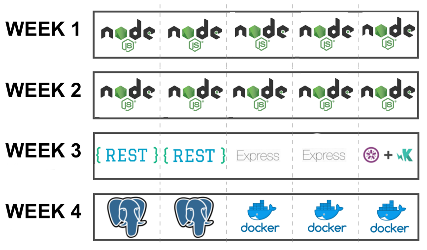

# UI Bootcamps - Node.Js


## __IMPORTANT DISCLAIMER__
This is not your typical _crash course_, this is a **Bootcamp**.

What does that mean?

- _You will give your best_

- _We will give our best_

- _We will all have a good time_


But most important, there will be **A LOT** of humor, because a happy developer _(student, pupil, padawan, you get the point...)_ is a great and hard working developer.


_That said..._


## Welcome to the bootcamp, learning time has begun


Please, use this repository as a base for all your work. The idea is to
fork this project so everyone uses the same folder structure for the
exercises.

#### Index

1. [Objective](#objective)

2. [Who Should Attend](#who-should-attend)

3. [Duration](#duration)

4. [Technical Assistance](#technical-assistance)

5. [Performance Measurement](#performance-measurement)

6. [Handling advanced Developers](#handling-advanced-developers)

7. [Materials](#materials)

8. [Bootcamp Schedule](#bootcamp-schedule)

9. [General Guidelines](#general-guidelines)

10. [Learning Days](#learning-days)

  - 10.1 [Week 1: Knowing your Node](#week-1-knowing-your-node)
  - 10.2 [Week 2: Js and Node: Brothers in arms](#week-2-js-and-node-brothers-in-arms)
  - 10.3 [Week 3: From REST to TEST](#week-3-from-rest-to-test)
  - 10.4 [Week 4: Store and Deploy](#week-4-store-and-deploy)

### Objective

We will teach you the basics of REST API development and Node.Js development.

→ [index](#index)

### Who Should Attend

The materials will start at a low level and does not require in depth knowledge
of the platform in question. Desirable participant profile: trainees and outside
Globant candidates. A basic knowledge on OOP is desired, though.

→ [index](#index)

### Duration

Four weeks total. (20 days)

→ [index](#index)

### Technical Assistance

You can contact other Bootcamp participants or any available tutor if you need
technical assistance. Communications will take place over [Slack](https://slack.com/features) on our own [Bootcamp Workspace](https://globant-bootcamps-lp.slack.com)

→ [index](#index)

### Performance Measurement

1. Code review after each practice.

2. Checkpoint completion after Learning stage with your assigned tutor.

3. Final Application after Bootcamp.

→ [index](#index)


### Handling Advanced Developers

Developers that move faster than average can go ahead and complete as much
exercises as wanted.

→ [index](#index)

### Materials

1. You will need to install [Node.JS](https://nodejs.org/en/) (Version 10) (NVM is strongly recommended - [Unix](https://github.com/creationix/nvm#installation)/[Windows](https://github.com/coreybutler/nvm-windows))

2. The recommended IDE is [Visual Studio Code](https://code.visualstudio.com/). However, you can use any IDE of your preference.

3. Gmail Account + headset (For hangout calls)

4. Create your own [GitHub](https://github.com/) account. Follow
this [guideline](https://help.github.com/articles/set-up-git) to setup your
account. Also you can read further about Git in
[Try Git](https://try.github.io/levels/1/challenges/1) or
[Learn Git Branching](http://pcottle.github.io/learnGitBranching/)

5. Fork this repo to use as a base to host the project code.

→ [index](#index)

### Bootcamp Schedule

The Bootcamp is organized in the following way:



TBD

The last week will be focused on starting an app and learning some _shiny cool_ stuff. You need to present your work at the end of the week, _however_
you can keep working on it (more on that later).

→ [index](#index)

### General Guidelines

1. [Team play](http://www.dummies.com/how-to/content/ten-qualities-of-an-effective-team-player.html) is encouraged but the work will be evaluated per person.

2. The instructions will be vague as they generally are in real life projects.
You must look for support and guidance from your PM, teammates and tutors.

3. All code and documentation must be in English.

4. `Js` code must adhere to Globant's [Js Style Guide](https://github.com/globant-ui/JavaScript-style-guide).

→ [index](#index)

### Learning Days ###

Each day you will grab the fundamentals of building blocks for usual
`Node` applications.

On each learning day you will have to:

1. **Read:**
We will provide you with documentation related with current sprint content so
you can have a background reference, guide and examples to complete the
following practice.

2. **Practice:**
You will implement the previously gathered knowledge in simple coding activities.

3. **Commit:**
You will commit all your code on a daily basis, when you finish your practice. This will not apply for code of Week 4.

→ [index](#index)

# Introduction

  - This repository contains inside the `src` directory the project structure for all exercises/challenges that you will
  need to do.

  - All `.js` code can be opened directly on the console. You can start a node process with `node PATH_TO_FILE`

  - A `start` script will be needed for processes. That should be used as `npm start`

  - [Basic GIT concepts](http://rogerdudler.github.io/git-guide/)

  - __READ THAT__ :arrow_up: :arrow_up: :arrow_up:

  - [Extra GIT material](https://www.acamica.com/cursos/29/git)

→ [index](#index)

_Now let's get down to business_

## Week 1: Knowing your Node
### Chapter 1: Intro
So you want to learn Node.js? Cool, I guess you already know JS, why would you be here if not?
Ok, you can always refresh some stuff [here](https://github.com/globant-ui/angular-bootcamp#day-3---5-hello-javascript)

So, now that we are on the same page let's start with the basics

>_Node.js is Javascript that runs on the server_


Yes, that's it. It uses Google's engine, (yes, Javascript runs on an engine) called [__V8__](https://v8.dev/) and you don't need a browser to use it.

#### Reading:
 - [What is Node.js](https://medium.freecodecamp.org/what-exactly-is-node-js-ae36e97449f5)
 - [Node versions](https://nodesource.com/blog/understanding-how-node-js-release-lines-work/)
 - [REPL](https://hackernoon.com/know-node-repl-better-dbd15bca0af6)

### Chapter 2:  Basics
FPO: let's add something here

#### Reading:
 - [NPM](https://docs.npmjs.com/about-npm)
 - [NVM](https://github.com/creationix/nvm)
 - [Modules](https://www.nodebeginner.org/blog/post/nodejs-tutorial-what-are-node.js-modules/)
 - [Debugging](https://www.nodebeginner.org/blog/post/nodejs-tutorial-what-are-node.js-modules/)
 - [Debugging on VS-Code](https://code.visualstudio.com/docs/nodejs/nodejs-debugging)

#### Excercise:
If guess you've noticed, but there's a folder called exercises. _Yes, you need to do them_

Go to [chapter_2](/exercises/chapter_2) and follow the instructions.

 → [index](#index)

## Week 2: Js and Node: Brothers in arms
### Chapter 3: All JS
 - [Scope & Closures](https://hackernoon.com/javascript-variable-scope-closures-a-primer-ace00b362eae)
 - [Callbacks](https://medium.freecodecamp.org/javascript-callbacks-explained-using-minions-da272f4d9bcd)
 - [Promises](https://hackernoon.com/understanding-promises-in-javascript-13d99df067c1)
 - [Async/Await](https://hackernoon.com/6-reasons-why-javascripts-async-await-blows-promises-away-tutorial-c7ec10518dd9)

 → [index](#index)

#### Excercise:
_You'd better have done the previous excercise_

Go to [chapter_3](/exercises/chapter_3) and follow the instructions.

#### ~Not so~ optional reading
- [Async programming & More](https://eloquentjavascript.net/11_async.html#h_HH3wvnWMnd)

### Chapter 4: FPO

## Week 3: From REST to TEST
### Chapter 5:  Getting

 - REST
 - Express
 - Middlewares
 - Validations

### Chapter 6: Testing
 - Generating Mock Responses
 - Testing

→ [index](#index)

## Week 4: Store and Deploy
### Chapter 6: Storing

 - SQL Databases
 - Postgres
 - Sequelize

### Chapter 7: Preparing for Production

 - Docker
 - Dotenv
 - JWT

 → [index](#index)

### Exercise:


#### _It's time to make an app from scratch_

TBD

**_Hey, don't panic. This excercise is for this week and on..._**

You have until the last day of this week to keep pushing changes. After that you can keep workin on the app, but please create a new branch for it:
```
luca.sartori@AR-IT12688:~/bootcamps/ui/week4$ git checkout -b 'post-bootcamp'

luca.sartori@AR-IT12688:~/bootcamps/ui/week4$ git push origin post-bootcamp
```

Your app should look something like this:

TBD

**Some advices**
- Dont't get scared. Even the most successfull Software Engineers and Architects forget things sometimes.
- Google is your friend, independence and curiosity are great values that every developer needs to have.
- The only way to learn is to fail, so keep failing.
- Theory is nice, but you need to get your hands dirty if you want things to stick.
- Remember, _a happy developer is a great developer_ (_also_, **coffee** is your best friend)

Kudos and keep ~~failing~~ learning!

→ [index](#index)


# BONUS

So... you've got your `Node` going, you read a **LOT** of stuff. So... What's next?


There're still a lot of stuff to read, some of them really work better under specific conditions or requirements. Remember:

_KEEP IT SIMPLE_

If there's a more advanced or complicated way to get to a solution it doesn't always mean that's the better approach.

With that in mind, here are some more advanced _(or not, this **whole** beatifull mess was made by a bored developer on a few days span)_ features that every one should know, and at least being able to explain them.

- [Socket IO](https://socket.io/)
- [No SQL Databases](https://www.mongodb.com/nosql-explained)
- [Caching](https://medium.com/@danielsternlicht/caching-like-a-boss-in-nodejs-9bccbbc71b9b)

Hey, If you need a place to kill time try [Medium](medium.com), there's a lot to read about pretty much anything (specially development related topics).
